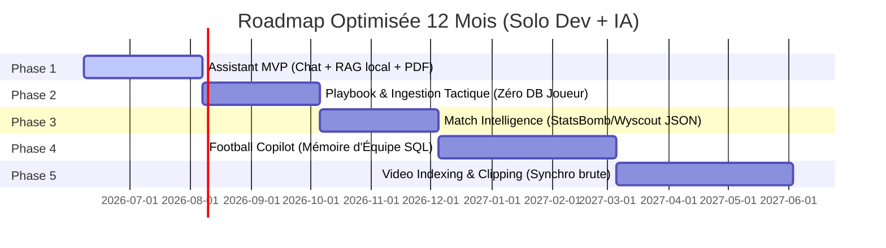

# 🗺️ Critique CTO & Roadmap Optimisée — Football IQ Assistant
**Par :** CTO SaaS IA (Ex-Founder, ayant construit et vendu des SaaS IA)

Ce document remet en question la roadmap initiale de Football IQ Assistant. L'objectif est d'éliminer toute complexité technique stérile pour se concentrer sur la **valeur utilisateur immédiate**, la **rétention hebdomadaire**, et la faisabilité réelle pour **un développeur seul aidé par des IA**.

---

## ⚡ 1. Critique Radicale de la Roadmap Actuelle

En tant que CTO, mon constat est simple : la roadmap précédente souffrait du syndrome classique de l'ingénieur ("over-engineering"). Elle privilégiait la structure de base de données (CRUD) et la complexité d'infrastructure au détriment de l'intelligence pure et de la friction utilisateur.

### 🔴 PHASE 1 : Football Assistant MVP
*   **Ce qui est pertinent :** Le triple mode (Coach / Analyste / Fan) et la génération de séances d'entraînement exportables en PDF. C'est l'usage premier.
*   **Ce qui est inutile/prématuré :** Mettre en place pgvector, Docker, ou des bases vectorielles cloud complexes. Un simple index plat local en mémoire (ou vectorisation locale via un fichier JSON d'embeddings mis en cache) suffit pour démarrer avec 30-50 documents.
*   **Ce qui apporte réellement de la valeur :** L'étanchéité et la spécificité des prompts. Si le mode Coach répond avec des banalités tactiques que l'on trouve sur ChatGPT classique, le produit est mort. La valeur réside dans le **ton ultra-spécifique** et les **formats de sortie exploitables** (fiches d'exercices structurées).

### 🟢 PHASE 2 : Playbooks Tactiques & Ingestion (Contre la DB Joueur)
*   **L'hypothèse utilisateur :** Centrer la Phase 2 sur les playbooks tactiques, la préparation de match, et l'analyse d'adversaire, et **NON sur les bases de données joueurs**.
*   **Validation CTO : 100% VRAI.** 
    *   *Pourquoi ?* Coder une gestion d'effectif avec fiches joueurs (nom, âge, pied fort, blessures) est un gouffre de plomberie CRUD sans valeur ajoutée IA. Il existe déjà SportEasy et MyCoach pour cela. Un coach n'a pas besoin d'un nouveau CRM.
    *   *La vraie valeur :* Ce que veut le coach, c'est de l'**intelligence contextuelle immédiate**. Il veut pouvoir uploader le plan de jeu de son club en PDF, y ajouter ses notes textuelles d'observation de l'adversaire ("leur numéro 4 est lent et rate ses relances sous pressing"), et obtenir un plan de match sur-mesure.

### 🟡 PHASE 3 : Match Intelligence (Statistiques avant Vidéo)
*   **Ce qui est réalisable en solo :** Parser des JSON d'événements (StatsBomb Open Data ou Wyscout JSON) et générer des cartes statiques de passes (passing networks) et de tirs (shot maps) via la bibliothèque Python `mplsoccer`.
*   **Ce qui crée de la valeur :** L'interprétation sémantique de la donnée par l'IA. La donnée brute n'intéresse pas le coach amateur (qui n'a pas le temps de l'analyser). L'IA doit agir comme un analyste pro qui résume le match : *"Votre équipe a perdu 60% de ses ballons dans le tiers médian gauche sous le pressing adverse."*
*   **Priorité :** Un parseur simple qui traduit le JSON d'événements de match en un résumé textuel pour le prompt de l'IA, puis génère des visualisations de base.

### 🔵 PHASE 4 : Football Copilot (Mémoire d'Équipe)
*   **Positionnement (Avant ou Après la vidéo ?) : AVANT LA VIDÉO.**
    *   *Pourquoi ?* La vidéo est un enfer technique (stockage, bande passante, encodage FFmpeg, synchronisation). Si vous commencez par la vidéo, vous allez passer 3 mois à régler des problèmes de buffering sans valeur IA.
    *   *La mémoire d'équipe :* Permettre à l'IA de se souvenir des 5 derniers matchs, des séances d'entraînement réalisées, et de proposer des recommandations basées sur l'historique ("Au dernier match, on a concédé 3 buts sur coup de pied arrêté, travaillons cela cette semaine"). C'est une simple table SQL relationnelle et c'est ce qui crée la **rétention hebdomadaire**.

### 🟣 PHASE 5 : Video Intelligence (Analyse Vidéo)
*   **Quelle est la partie réellement utile ?** La **synchronisation temporelle** (cliquer sur un événement statistique dans le chat et voir la vidéo sauter au bon timestamp) et le **clipping automatique** (générer un fichier compressé de tous les corners du match).
*   **Quelle est la partie gadget ?** Le tracking 2D/3D automatique en temps réel des joueurs avec des lignes complexes dessinées sous leurs pieds dans le navigateur. C'est bon pour faire une démo Twitter, mais inutile au quotidien pour un coach amateur qui veut juste montrer des clips bruts à ses joueurs.
*   **Par quoi commencer ?** La synchronisation événement/timestamp. C'est 10 fois plus simple à coder qu'un modèle YOLO et cela résout 90% du besoin de gain de temps de l'analyste vidéo.
*   **Quand YOLO/Tracking devient rentable ?** YOLO devient utile uniquement pour automatiser l'acquisition de données (détecter les phases de jeu si le coach n'a pas de fichier d'événements Wyscout). Le tracking continu (ByteTrack/DeepSORT) n'est **pas rentable pour un développeur solo** : trop de faux positifs sur les vidéos amateurs de mauvaise qualité, coûts de calcul GPU trop élevés pour un SaaS à bas coût.

---

## 🚀 2. La Roadmap Optimisée sur 12 Mois (Développeur Solo + IA)



---

### ⏱️ Tableau de Synthèse des Phases

| Phase | Valeur Utilisateur | Difficulté Technique | Temps Estimé (Solo) | Risque d'Échec | Potentiel Business |
| :--- | :--- | :--- | :--- | :--- | :--- |
| **Phase 1 : Assistant MVP** | **Moyenne** (Excellent outil d'idéation rapide) | **Très Faible** (2/10) | 1.5 mois | **Faible** (15%) | **Faible** (Produit facilement copiable) |
| **Phase 2 : Playbook & Ingestion** | **Élevée** (L'IA adopte la philosophie du coach) | **Faible** (3.5/10) | 2 mois | **Faible** (20%) | **Moyen** (Premiers abonnements individuels) |
| **Phase 3 : Match Intelligence** | **Très Élevée** (Interprétation de données pro) | **Moyenne** (5.5/10) | 2 mois | **Moyen** (35%) | **Élevé** (Cible les clubs semi-pros et analystes) |
| **Phase 4 : Football Copilot** | **Critique** (Création de la boucle de rétention) | **Faible** (4/10) | 3 mois | **Faible** (15%) | **Très Élevé** (L'outil devient indispensable au quotidien) |
| **Phase 5 : Video Indexing** | **Maximale** (Le Saint Graal de l'analyste) | **Élevée** (7.5/10) | 3.5 mois | **Élevé** (50%) | **Énorme** (Vente aux staffs techniques complets) |

---

### 🔍 Spécifications Détaillées des Phases

#### PHASE 1 : Football Assistant MVP
*   **Objectif :** Créer un assistant football spécialisé dont les réponses tactiques dépassent largement celles d'un ChatGPT générique.
*   **Ce qu'il faut construire :**
    1.  Une interface de chat en Dark Mode sans système de compte (accès direct pour éliminer la friction).
    2.  Trois prompts système extrêmement robustes (Coach / Analyste / Fan) stockés sous forme de templates.
    3.  Un moteur RAG local qui lit les concepts de jeu depuis un dossier de fichiers Markdown (`data/knowledge_base/`).
    4.  Affichage des sources documentaires en bas de chaque réponse pour asseoir la crédibilité.
    5.  Bouton d'export PDF propre pour les séances d'entraînement (avec structure en 4 blocs : Échauffement, Exercice 1, Exercice 2, Jeu final).
*   **Ce qu'il ne faut surtout pas construire :**
    *   Pas de base de données PostgreSQL, pas d'inscription, pas d'abonnements, pas de gestion de profils joueurs. Tout est stocké en session locale dans le navigateur.
*   **Critères de validation :**
    *   Un coach amateur peut générer une séance d'entraînement sur le "bloc bas" en 3 clics, l'exporter en PDF, et déclarer qu'elle est prête à 90% pour sa séance du soir.

#### PHASE 2 : Playbook & Ingestion Tactique
*   **Objectif :** Rendre l'IA intelligente vis-à-vis de la philosophie spécifique du coach et de ses rapports d'observation.
*   **Ce qu'il faut construire :**
    1.  Un onglet "Mon Playbook" permettant d'uploader des fichiers tactiques (PDF, TXT, images de schémas de jeu).
    2.  Un parseur d'images de schémas tactiques (utilisation des capacités multimodales de GPT-4o pour interpréter un dessin de tableau noir).
    3.  Une base PostgreSQL locale simple avec l'extension `pgvector` pour stocker les morceaux de documents tactiques du coach.
    4.  L'intégration du RAG privé : les réponses de l'IA s'appuient d'abord sur la philosophie de jeu uploadée par le coach avant d'utiliser la base générale.
*   **Ce qu'il ne faut surtout pas construire :**
    *   La base de données d'effectif joueurs (nom, prénom, statistiques physiques). C'est inutile à ce stade.
*   **Critères de validation :**
    *   Le coach upload son document "Principes de transition offensive.pdf". Lorsqu'il demande à l'IA de lui concevoir un exercice, l'IA utilise exactement les termes et concepts définis dans son PDF.

#### PHASE 3 : Match Intelligence
*   **Objectif :** Convertir des fichiers statistiques de match bruts en rapports tactiques exploitables.
*   **Ce qu'il faut construire :**
    1.  Un importateur de données d'événements (format JSON de type StatsBomb / Wyscout).
    2.  Un script python utilisant `mplsoccer` pour dessiner automatiquement des shot maps et des passing networks sous forme de fichiers PNG/SVG.
    3.  Un module d'analyse sémantique : l'IA prend le résumé des statistiques en entrée et rédige un rapport de match critique en 3 parties (Points forts, Faiblesses tactiques, Recommandations pour le prochain entraînement).
*   **Ce qu'il ne faut surtout pas construire :**
    *   Un éditeur graphique interactif de schémas. Les images générées doivent être statiques et prêtes à être intégrées au PDF de match.
*   **Critères de validation :**
    *   L'utilisateur importe un JSON de match et obtient un rapport d'analyse écrit cohérent accompagné de 2 graphiques corrects (Shot Map + Passing Network).

#### PHASE 4 : Football Copilot (La Mémoire d'Équipe)
*   **Objectif :** Centraliser l'historique d'entraînement, de match et de notes tactiques pour proposer des recommandations contextuelles automatisées.
*   **Ce qu'il faut construire :**
    1.  Un modèle de données Postgres unifiant l'historique de l'équipe (Matchs joués, scores, séances d'entraînement réalisées, notes de débriefing).
    2.  L'indexation de l'historique dans le RAG : l'IA sait ce qui a été travaillé les semaines passées.
    3.  Génération automatique de recommandations d'entraînement hebdomadaires : l'IA analyse le débrief du dernier match (Phase 3) et propose les 3 thèmes prioritaires à travailler cette semaine.
*   **Ce qu'il ne faut surtout pas construire :**
    *   La vidéo (Phase 5). On stabilise d'abord ce système de recommandation hebdomadaire qui est le vrai moteur de rétention.
*   **Critères de validation :**
    *   Le coach pose la question : "Que doit-on travailler cette semaine ?", l'IA répond : *"Suite aux 3 buts encaissés sur coup de pied arrêté au dernier match et au fait que nous n'avons pas travaillé les phases arrêtées depuis 3 semaines, je recommande une séance sur..."*

#### PHASE 5 : Video Intelligence (Synchro & Clips)
*   **Objectif :** Synchroniser la vidéo du match avec les données d'événements pour simplifier le montage tactique.
*   **Ce qu'il faut construire :**
    1.  Un lecteur vidéo HTML5 standard (`video.js`) capable de lire un fichier vidéo local ou stocké sur un serveur de fichiers simple.
    2.  La synchronisation temporelle : mapper les timestamps du JSON de match (Phase 3) sur la timeline vidéo.
    3.  Une interface de timeline interactive : le coach clique sur une ligne statistique (ex: "Perte de balle de notre numéro 8 à la 54ème minute") et la vidéo saute instantanément à 53:50.
    4.  Un exportateur de clips : intégrer un script FFmpeg backend ultra-rapide qui découpe la vidéo brute selon les timestamps sélectionnés et permet de télécharger un fichier compressé (ex: "Tous les tirs du match.mp4").
*   **Ce qu'il ne faut surtout pas construire :**
    *   Du tracking de joueurs ou de la détection de trajectoire de ballon en 3D temps réel via Computer Vision. C'est trop lourd, trop coûteux, et hors de portée d'un développeur solo.
*   **Critères de validation :**
    *   L'utilisateur peut importer sa vidéo de match et son fichier JSON, cliquer sur un bouton "Générer clip corner" et obtenir un fichier MP4 de 10 secondes contenant l'action ciblée.

---

## 🎯 3. La Séquence de Développement Optimale pour 100 Coachs Actifs Hebdomadaires

> [!IMPORTANT]
> Si mon objectif était de créer un produit utilisé **chaque semaine** par **100 coachs réels**, voici la séquence exacte d'actions que je suivrais au jour le jour. 
> Elle est dictée par la recherche constante de valeur utilisateur et l'évitement de tout développement inutile.

```
Jours 1-15: Contenu & Prompts (Zéro code)
      │
      ▼
Jours 16-35: MVP sans inscription (Lancement Bêta)
      │
      ▼
Jours 36-60: Ingestion Playbooks (Rétention Initiale)
      │
      ▼
Jours 61-90: Match Intelligence (Import Données Wyscout/StatsBomb)
      │
      ▼
Jours 91-120: Mémoire d'Équipe (Rétention Hebdomadaire Systématique)
      │
      ▼
Jours 121+: Sync Vidéo & Clips
```

### 1. Jours 1 à 15 : Le contenu d'abord, le code après
*   **Action :** Je ne tape pas une seule ligne de code d'application. J'écris 20 fichiers Markdown tactiques d'une qualité exceptionnelle (les "concepts clés").
*   **Test :** Je teste mes prompts système sur le terrain en demandant à Claude/GPT-4o d'utiliser ces concepts pour rédiger des séances. Je montre ces séances à 5 coachs de mon réseau. S'ils me disent : *"C'est génial, c'est exactement ce que je fais sur le terrain"*, je valide. S'ils disent : *"C'est un peu générique"*, je réécris les fiches tactiques.
*   **Raisonnement :** Si l'intelligence n'est pas là, le plus beau design du monde ne sauvera pas le produit.

### 2. Jours 16 à 35 : Le MVP sans inscription (Friction Zéro)
*   **Action :** Je construis l'interface de chat simple avec FastAPI et Tailwind. Le RAG est codé de manière ultra-minimaliste (un dictionnaire Python en mémoire qui charge les fichiers markdown tactiques).
*   **Déploiement :** Je mets l'app en ligne sur Render/Railway (coût : 5$/mois). Il n'y a pas de bouton d'inscription. N'importe qui peut l'utiliser. C'est l'**acquisition massive**.
*   **Objectif :** Trouver 50 coachs bêta-testeurs via Twitter/X ou en allant directement voir les clubs amateurs locaux.

### 3. Jours 36 à 60 : Ingestion Playbook (Le "Aha Moment")
*   **Action :** J'ajoute le téléverseur de PDF tactiques. Le coach peut maintenant importer la charte de son club. 
*   **Raisonnement :** C'est le moment où le coach réalise que l'assistant n'est plus une IA externe, mais **son** adjoint personnel qui parle la même langue que lui.

### 4. Jours 61 à 90 : L'Analyse de Match Automatisée
*   **Action :** J'implémente le parseur JSON StatsBomb/Wyscout. Le coach peut uploader ses données statistiques brutes de week-end et obtenir en 10 secondes un rapport rédigé par l'IA décrivant les faiblesses physiques et tactiques du match.

### 5. Jours 91 à 120 : La Mémoire d'Équipe (Verrouiller l'usage hebdomadaire)
*   **Action :** J'introduis enfin la base de données relationnelle SQL. Le coach peut créer son espace, ce qui lui permet de lier son rapport de match de la semaine dernière à ses séances de cette semaine.
*   **Objectif des 100 coachs actifs hebdomadaires :** À ce stade, le coach utilise l'outil tous les lundis pour analyser le match du week-end, et tous les mardis/jeudis pour générer et exporter en PDF ses séances d'entraînement basées sur les faiblesses identifiées. La boucle d'utilisation hebdomadaire est fermée.

### 6. Jours 121+ : La Vidéo par la synchro temporelle brute
*   **Action :** J'ajoute l'importateur de fichiers vidéos avec synchronisation événementielle. Pas de Computer Vision complexe. Juste la possibilité pour le coach de naviguer dans sa vidéo de 90 minutes en cliquant sur les statistiques clés générées en étape 4.

Ce plan garantit qu'en moins de 2 mois, un produit fonctionnel et intelligent est dans les mains des utilisateurs, et qu'à 4 mois, la boucle d'utilisation hebdomadaire est solidement ancrée, le tout développé par une seule personne sans coût d'infrastructure lourd.
