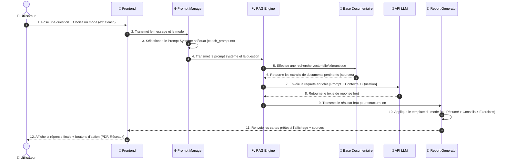

# 🏗️ Architecture Technique — Football IQ Assistant

Ce document détaille l'architecture modulaire et les flux d'exécution de l'application **Football IQ Assistant**. Il sert de carte de référence pour comprendre comment les différents composants interagissent entre eux.

---

## 🗺️ 1. Plan et Cartographie des Composants

Le diagramme ci-dessous illustre l'organisation du projet en 4 couches distinctes : **l'Interface (Frontend)**, la **Logique (Backend)**, le **Stockage (Data)**, et les **Services Externes / Futures Évolutions**.

```mermaid
flowchart TB
    %% Styling Configuration (Couleurs & Formes)
    classDef clientStyle fill:#e0f2fe,stroke:#0284c7,stroke-width:2px,color:#0369a1,rx:10px,ry:10px;
    classDef backendStyle fill:#d1fae5,stroke:#059669,stroke-width:2px,color:#047857,rx:8px,ry:8px;
    classDef dataStyle fill:#fef3c7,stroke:#d97706,stroke-width:2px,color:#b45309,shape:cylinder;
    classDef externalStyle fill:#fee2e2,stroke:#dc2626,stroke-width:2px,color:#991b1b,rx:15px,ry:15px;
    classDef futureStyle fill:#f3e8ff,stroke:#7c3aed,stroke-width:2px,color:#6d28d9,stroke-dasharray: 5 5;

    %% 🎨 Layer 1: Frontend
    subgraph FE ["🎨 FRONTEND (Interface Utilisateur)"]
        UI["💻 UI: Main Chat Interface"]:::clientStyle
        S_Mode["🎛️ Mode Selector<br>(Coach | Analyst | Fan)"]:::clientStyle
        UI <--> S_Mode
    end

    %% ⚙️ Layer 2: Backend
    subgraph BE ["⚙️ BACKEND (Logic & Intelligence)"]
        PM["📝 Prompt Manager<br>(System Prompts Selector)"]:::backendStyle
        RAG["🔍 RAG Engine<br>(Retrieval & Context Injection)"]:::backendStyle
        RG["📄 Output Formatter & Report Gen<br>(PDF Export / Social Media Formatting)"]:::backendStyle
        
        PM --> RAG
    end

    %% 📂 Layer 3: Storage & Knowledge
    subgraph DB ["📂 DATA (Base de Connaissances)"]
        FKB[("📚 Football Knowledge Base<br>(Fichiers TXT/MD)")]:::dataStyle
        TC[("📐 Tactical Concepts & Drills<br>(Modèles Structurés)")]:::dataStyle
        ME[("📊 Match Events Database<br>(Mock JSON logs)")]:::dataStyle
    end

    %% 🔌 External services
    subgraph Ext ["🔌 SERVICES TIERS"]
        LLM_API["🧠 API LLM<br>(OpenAI / Anthropic)"]:::externalStyle
    end

    %% 🔮 Future Layer
    subgraph FUT ["🔮 FUTUR MODULE"]
        VA["📹 Analyse Vidéo<br>(Computer Vision)"]:::futureStyle
    end

    UI -->|1. Saisie question + Mode| PM
    RAG <-->|2. Requête sémantique| DB
    RAG -->|3. Invite enrichie (Prompt + Contexte)| LLM_API
    LLM_API -->|4. Génération brute| RG
    RG -->|5. Cartes structurées / PDF| UI

    %% Module futur
    VA -.->|Écrit les logs de jeu| ME
```

---

## 🔄 2. Séquence d'Exécution d'une Requête (Dataflow)

Ce graphique montre le parcours chronologique d'un message envoyé par l'utilisateur, de sa saisie sur l'interface jusqu'au formatage de la réponse finale par l'IA.



---

## 📂 3. Organisation Physique du Code (Arborescence)

Voici l'organisation visuelle des fichiers du dépôt, alignée avec l'architecture définie :

```text
football-iq-assistant/
├── 📁 frontend/                # Partie Client (Interface React / Next.js)
│   ├── 📁 components/
│   │   ├── 📄 ChatWindow.js     # Boîte de dialogue et affichage des messages
│   │   ├── 📄 ModeSelector.js  # Boutons de sélection Coach, Analyste, Fan
│   │   └── 📄 ResponseCard.js  # Formatage visuel des réponses structurées
│   └── 📁 styles/
│
├── 📁 backend/                 # Partie API & Traitement (Python FastAPI / Flask)
│   ├── 📄 app.py               # Point d'entrée de l'API
│   ├── 📄 rag_engine.py        # Logique de recherche et d'injection de contexte
│   ├── 📄 prompt_manager.py    # Chargement dynamique des instructions système
│   └── 📄 report_generator.py  # Export PDF et formatage pour les réseaux
│
├── 📁 data/                    # Base de Connaissances Football
│   ├── 📁 knowledge_base/      # Fichiers sources pour le RAG
│   │   ├── 📄 pressing.md
│   │   ├── 📄 formations.md
│   │   └── 📄 player_roles.md
│   └── 📁 match_events/        # Logs de match fictifs pour le futur module
│       └── 📄 mock_match.json
│
└── 📁 prompts/                 # Templates de prompts système
    ├── 📄 coach_prompt.txt
    ├── 📄 analyst_prompt.txt
    └── 📄 fan_prompt.txt
```

---

## 💡 4. Rôles et Responsabilités

| Composant | Description & Responsabilité | Clé de Conception |
| :--- | :--- | :--- |
| **Frontend** | Responsable de l'ergonomie et de la sélection de mode. | Doit offrir un effet "Wow" avec un Dark Mode et des transitions fluides. |
| **Prompt Manager** | Gère la personnalité de l'IA (le ton et les règles de réponse). | Isole les invites pour les modifier sans toucher au code backend. |
| **RAG Engine** | Recherche et extrait les données tactiques d'aide à la décision. | Évite les hallucinations en forçant l'IA à utiliser les sources fournies. |
| **Report Generator** | Met en forme le résultat sous forme de fichiers ou formats partageables. | Intègre les boutons d'export en un clic (PDF et Post Réseau). |
