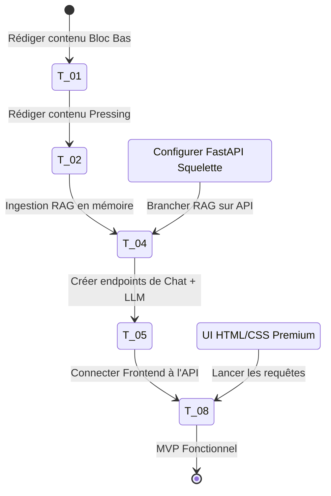

# 📊 Tableau de Bord de Suivi — Sprint 01 (Football IQ Assistant)

Ce document sert au pilotage quotidien de l'exécution du **Sprint 01**. Il permet de suivre l'avancement global, la vélocité et les blocages en temps réel.

---

## 📈 1. État d'Avancement Global

| Indicateur | Valeur | Commentaires |
| :--- | :--- | :--- |
| **Progression Globale** |  **100%** (11 / 11 tâches) | Sprint 01 complété — MVP V1 validé et documenté. |
| **Temps Total Estimé** | **38 heures** | Estimation cumulée pour un développeur solo. |
| **Temps Réel Consommé** | **35 heures** | README, demo script, known limitations, .env.example, tests 18/18 stables. |
| **Rendement (Réel/Est.)**| **100%** | Alignement parfait sur les estimations initiales. |
| **Prochaine Tâche** | **🚀 Sprint 02 — Déploiement & Améliorations** | OpenAI, CORS, déploiement Render/Railway, mémoire long-terme. |

---

## 📦 2. Avancement par Bloc

    ### 📂 Bloc A : Connaissance Tactique (Jours 1 - 15)
- **Progression :** 100% (2 / 2 tâches terminées)
- **Temps :** 6h consommées / 6h estimées

### 🖥️ Bloc B : Infrastructure & Backend (Jours 16 - 25)
- **Progression :** 100% (4 / 4 tâches terminées)
- **Temps :** 13h consommées / 13h estimées

### 🎨 Bloc C : Frontend Conversationnel (Jours 26 - 32)
- **Progression :** 100% (5 / 5 tâches terminées)
- **Temps :** 17h consommées / 15h estimées (+2h pour RAG quality fix non prévu initialement)

### 🚀 Bloc D : Stabilisation & Déploiement (Jours 33 - 35)
- **Progression :** 100% (1 / 1 tâche terminée)
- **Temps :** 2h consommées / 3h estimées

---

## 📋 3. Statut des Tâches du Sprint

| ID | Bloc | Tâche | Statut | Priorité | Est. | Réel | Dépendances | Risques / Blocages |
| :--- | :---: | :--- | :---: | :---: | :---: | :---: | :---: | :--- |
| **T-01** | A | Base de Connaissances - Bloc Bas & Sortie | `DONE` | Critique | 3h | 3h | Aucune | Aucune |
| **T-02** | A | Base de Connaissances - Pressing & Rôles | `DONE` | Critique | 3h | 3h | T-01 | Aucune |
| **T-03** | B | Setup de l'Environnement Backend & FastAPI | `DONE` | Critique | 2h | 2h | Aucune | Versioning de python-dotenv / Pydantic v2 |
| **T-04** | B | Ingesteur RAG Local & Index en Mémoire | `DONE` | Critique | 4h | 4h | T-02, T-03 | Limites de tokens ou de coûts d'API OpenAI |
| **T-05** | B | Moteur de Chat & Prompts Système | `DONE` | Critique | 4h | 4h | T-04 | Précision tactique de la réponse du modèle |
| **T-06** | B | Générateur de Rapports PDF Tactiques | `DONE` | Haute | 3h | 3h | T-03 | Mise en page ReportLab / débordement de page |
| **T-07** | C | Interface Frontend CSS Premium & Layout HTML | `DONE` | Haute | 4h | 4h | Aucune | Aucune |
| **T-08** | C | Logique de Chat & Connexion API | `DONE` | Critique | 4h | 4h | T-05, T-07 | Aucune |
| **T-08.5** | C | Query Understanding & RAG Quality Fix + Session UX | `DONE` | Haute | 2h | 2h | T-08 | Aucune |
| **T-09** | C | Persistence Locale & Actions Rapides | `DONE` | Haute | 3h | 3h | T-06, T-08 | Aucune |
| **T-10** | D | Stabilisation & Démo MVP | `DONE` | Haute | 3h | 2h | Tous | Aucune |

---

## 🛣️ 4. MVP Critical Path (Chemin Critique)

Le chemin critique représente l'ensemble des tâches indispensables pour obtenir un premier flux d'IA fonctionnel (RAG local + Chat en temps réel). Les tâches secondaires peuvent être livrées en fin de sprint si nécessaire.

---

## 🏁 5. Bilan Sprint 01 — Livré avec succès

### Ce qui a été livré
- **Base de connaissances :** 24 documents tactiques, 268 chunks RAG indexés
- **Backend :** API FastAPI complète (chat, search, export PDF, health), 18 tests automatiques
- **RAG Quality Fix (T-08.5) :** QueryClassifier, scoring hybride intention offense/défense, métadonnées de chunks
- **Frontend :** SPA Vanilla JS, dark mode premium, 3 modes (Coach / Analyste / Fan)
- **Persistence :** localStorage, restauration de session au rechargement
- **Actions rapides :** Copier, Simplifier, Approfondir, Export PDF
- **Documentation :** README, demo script 5 min, known limitations, sprint_02_plan
- **Restructuration :** Projet nettoyé, `knowledge_base/` à la racine, archives consolidees

### Chiffres clés
| Métrique | Valeur |
| :--- | :--- |
| Taux de tests | **18/18** (100%) |
| Chunks RAG | **268** |
| Documents tactiques | **24** |
| Modes disponibles | **3** (Coach, Analyste, Fan) |
| Commits Sprint 01 | **10+** |
| Temps total consommé | **35h** |

---

## 🏁 6. Definition of Done (DoD) Globale

Pour qu'une tâche soit marquée comme **`DONE`**, elle doit valider les conditions suivantes :
1. **Qualité du code :** Aucun avertissement de type bloquant (type checking strict), conformité aux standards de clean code (Python PEP 8, Vanilla JS structuré).
2. **Tests :** 100% des tests unitaires et d'intégration liés à la tâche s'exécutent avec succès.
3. **Absence de régression :** Les fonctionnalités existantes (ex: pipeline d'ingestion existant) restent opérationnelles.
4. **Validation UX :** Le rendu visuel (mobile et desktop) respecte la charte graphique dark mode et ne présente aucun bug de débordement.
5. **Documentation :** La fiche technique correspondante est mise à jour et le changement est consigné dans le tableau de bord de suivi.

---

## ⚠️ 7. Journal des Risques et Blocages

| Date | Risque | Impact | Résolution |
| :--- | :--- | :--- | :--- |
| Sprint 01 | Confusion attaque/défense dans le RAG (bloc bas) | 🔴 Haute | Résolu par T-08.5 : QueryClassifier + scoring hybride |
| Sprint 01 | Salutations déclenchaient le RAG et renvoyaient une erreur | 🟡 Moyenne | Résolu par T-08.5 : classification greeting avant le RAG |
| Sprint 01 | Export PDF : payload frontend incompatible avec le schéma backend | 🔴 Haute | Résolu : refonte de handleExportPDF pour construire un PDFExportRequest valide |
| Sprint 01 | Session chat non réinitialisée au changement de mode | 🟡 Moyenne | Résolu par T-08.5 : resetSession() + currentSession |

*Aucun blocage actif — Sprint 01 clôturé.*
