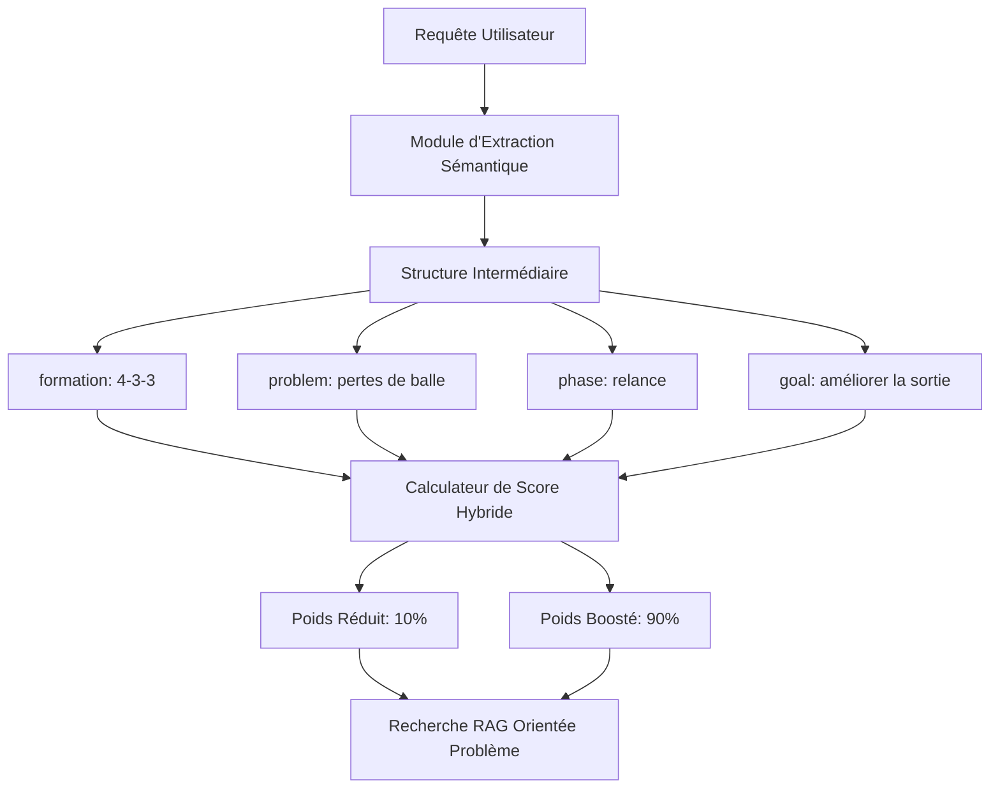

# Diagnostic Tactique : Vers un Retrieval Orienté Problème

Ce document présente l'analyse d'une faiblesse critique du système RAG actuel de **Football IQ Assistant** et définit les spécifications pour une recherche sémantique orientée problème (Problem-Oriented Retrieval).

---

## 🔍 1. Diagnostic de la Faiblesse Actuelle

### Le Symptôme
Lorsqu'un utilisateur pose une question combinant un **système de jeu** (ex: `4-3-3`) et un **problème de terrain** (ex: `pertes de balle à la relance`), le moteur RAG renvoie en priorité la fiche descriptive du système (`formation_433.md`), au détriment de la fiche apportant la solution concrète au problème (`sortie_balle.md`).

### La Cause Technique : La Domination Lexicale (TF-IDF Bias)
1. **Poids IDF élevé des formations** : Les termes numériques comme `4-3-3`, `3-5-2` ou `433` sont sémantiquement très spécifiques et rares à l'échelle globale de la base de connaissances (IDF élevé). Le moteur TF-IDF leur attribue donc un poids mathématique prépondérant.
2. **Fréquence du terme (TF) dans les fiches de formations** : Le document `formation_433.md` répète le terme `4-3-3` de nombreuses fois, ce qui gonfle artificiellement le score de similarité de ce document par rapport à `sortie_balle.md` qui ne mentionne ce système qu'une ou deux fois à titre d'exemple.
3. **Absence de distinction contexte vs problème** : Le système traite tous les mots de la requête sur le même plan horizontal. Il ne comprend pas que *"Je joue en 4-3-3"* est un **contexte secondaire** tandis que *"mon équipe perd trop de ballons à la relance"* est le **problème principal**.

---

## 🛠️ 2. Architecture de la Solution Proposée

Pour corriger ce biais, nous devons passer d'une recherche lexicale brute à une **recherche structurée et pondérée sémantiquement**.

### Étape 1 : L'Extraction Structurée
Le `QueryClassifier` doit être enrichi d'un extracteur (par expressions régulières et lexique ciblé) pour structurer la requête sous la forme suivante :
- **System** : La formation mentionnée (ex: `4-3-3`).
- **Problem** : Le point de douleur identifié (ex: `pertes de balle`, `fatigue`, `transpercer`, `erreurs`).
- **Phase** : La phase de jeu concernée (ex: `relance`, `pressing`, `repli`, `transition`).
- **Goal** : L'objectif de l'utilisateur (ex: `conserver`, `récupérer`, `protéger`).

### Étape 2 : Le Scoring Pondéré (Hybrid Weighting)
Lors de la recherche RAG, le score final d'un chunk $S_{final}$ sera calculé selon la formule :

$$S_{final} = \alpha \cdot S_{problem\_phase} + \beta \cdot S_{system\_context}$$

Où :
- $S_{problem\_phase}$ est la similarité calculée uniquement sur les mots-clés du problème et de la phase de jeu.
- $S_{system\_context}$ est la similarité calculée sur la formation et le contexte secondaire.
- **Pondération cible** : $\alpha = 0.9$ (90% du poids sur la solution) et $\beta = 0.1$ (10% du poids sur l'adaptation au système).

---

## 📋 3. Batterie de 20 Cas Tests : Analyse des Écarts

Voici 20 exemples concrets illustrant le décalage entre le comportement actuel du RAG et le comportement attendu.

| ID | Requête Utilisateur | Retrieval Actuel (TF-IDF) | Retrieval Attendu (Orienté Problème) | Écart Observé & Impact Tactique |
|---|---|---|---|---|
| **1** | *"Je joue en 4-3-3 mais mon équipe perd trop de ballons à la relance."* | `formation_433.md` | `sortie_balle.md` | **Écart Majeur** : L'utilisateur reçoit une description générale du 4-3-3 au lieu de schémas de relance sous pression. |
| **2** | *"En 3-5-2, on se fait transpercer sur les longs ballons dans le dos."* | `formation_352.md` | `player_roles_defensive_sweeper_keeper.md` ou `transition_defensive_repli.md` | **Écart Majeur** : Propose le rôle des pistons au lieu de la couverture de la profondeur et du rôle de gardien-libéro. |
| **3** | *"J'utilise un 4-4-2 mais mes joueurs ne coulissent pas assez vite."* | `formation_442.md` | `analyse_video_coulissement_bloc.md` | **Écart Moyen** : Le 4-4-2 occulte les principes physiques et exercices de coulissement horizontal. |
| **4** | *"Comment contrer le double pivot d'un 4-2-3-1 en fermant l'axe ?"* | `formation_423_1.md` | `player_roles_defensive_sentinelle.md` ou `tactics_defensive_defense_zone.md` | **Écart Moyen** : Présente l'animation du 10 au lieu des techniques d'interception axiale. |
| **5** | *"Mes pistons en 3-4-3 s'épuisent trop vite et ne reviennent pas."* | `formation_343.md` | `player_roles_offensive_piston.md` | **Écart Moyen** : Donne la structure globale à 3 défenseurs au lieu de traiter le rôle et la charge athlétique du piston. |
| **6** | *"Je veux contrer rapidement en 4-1-4-1 mais mes relayeurs ne se projettent pas."* | `formations_multi_4141_equilibre.md` | `transition_offensive_rapide.md` | **Écart Majeur** : Le RAG se concentre sur l'équilibre du 4-1-4-1 au lieu de la verticalité de la transition. |
| **7** | *"En 4-3-3, comment éviter que notre sentinelle soit étouffée par leur marquage ?"* | `formation_433.md` | `player_roles_defensive_sentinelle.md` ou `tactics_offensive_passe_troisieme_homme.md` | **Écart Majeur** : Présente le triangle pointe basse au lieu des solutions de sortie par le troisième homme. |
| **8** | *"On joue en 5-4-1 bloc bas mais on n'arrive jamais à garder le ballon à la récup."* | `formations_multi_541_bloc_bas.md` | `transition_offensive_rapide.md` ou `player_roles_offensive_faux_9.md` | **Écart Majeur** : Reste sur la structure du bloc bas au lieu de donner des solutions d'appui-remise (garder le ballon). |
| **9** | *"Mon gardien en 4-3-3 fait trop d'erreurs au pied sous pression."* | `formation_433.md` | `player_roles_defensive_sweeper_keeper.md` ou `sortie_balle.md` | **Écart Majeur** : La formation éclipse le problème technique et de placement du gardien de but. |
| **10** | *"En 4-2-3-1, notre numéro 10 et notre buteur se marchent dessus."* | `formation_423_1.md` | `player_roles_offensive_faux_9.md` | **Écart Moyen** : Présente le rôle des milieux excentrés au lieu de la gestion de l'interligne et du décrochage. |
| **11** | *"Comment briser un pressing tout-terrain agressif en 3-5-2 ?"* | `formation_352.md` | `sortie_balle.md` | **Écart Majeur** : Ignore les principes de relance basse sous pression pour détailler la largeur du 3-5-2. |
| **12** | *"Mon équipe en 4-4-2 se fait aspirer au pressing et laisse des trous derrière."* | `formation_442.md` | `tactics_defensive_rest_defense.md` ou `tactics_defensive_compacite_bloc.md` | **Écart Majeur** : Propose le 4-4-2 à plat au lieu de la défense préventive (rest defense) et de la compacité verticale. |
| **13** | *"En 3-4-3, comment défendre sur les centres adverses au second poteau ?"* | `formation_343.md` | `phase_offensive_centres_surface.md` (ou fiches centres) | **Écart Moyen** : Se focalise sur les pistons au lieu de l'organisation aérienne de la surface de réparation. |
| **14** | *"Comment animer le double pivot en 4-2-3-1 pour résister à leur harcèlement ?"* | `formation_423_1.md` | `sortie_balle.md` | **Écart Moyen** : Le 4-2-3-1 est favorisé au détriment des concepts de sortie sous pression (appui court). |
| **15** | *"Je perds tous mes ballons de contre-attaque en 4-3-3 car les passes sont trop lentes."* | `formation_433.md` | `transition_offensive_rapide.md` | **Écart Majeur** : Offre la description du 4-3-3 au lieu de la verticalité immédiate requise en transition offensive. |
| **16** | *"En 5-4-1, nos latéraux se font dédoubler constamment."* | `formations_multi_541_bloc_bas.md` | `analyse_video_coulissement_bloc.md` ou `pressing_haut.md` | **Écart Moyen** : Présente la muraille à 5 au lieu de traiter le coulissement défensif face aux surcharges adverses. |
| **17** | *"Comment créer le surnombre au milieu en 4-3-3 avec un latéral qui rentre ?"* | `formation_433.md` | `player_roles_offensive_inverted_fullback.md` | **Écart Majeur** : Présente le milieu en triangle classique au lieu du rôle moderne de latéral inversé. |
| **18** | *"J'entraîne en 3-5-2 et on subit trop de transitions sur les ailes."* | `formation_352.md` | `tactics_defensive_rest_defense.md` | **Écart Majeur** : Présente les pistons au lieu de la structure préventive pour tuer les contres à la racine. |
| **19** | *"Mon attaquant de pointe en 4-1-4-1 est complètement sevré de ballons."* | `formations_multi_4141_equilibre.md` | `player_roles_offensive_faux_9.md` ou `principe_superiorite_numerique.md` | **Écart Moyen** : Détaille la sentinelle au lieu de la création de relais offensifs pour le 9. |
| **20** | *"Comment enclencher le pressing de zone en 4-4-2 à plat ?"* | `formation_442.md` | `tactics_defensive_defense_zone.md` ou `pressing_haut.md` | **Écart Moyen** : Favorise le système au détriment des notions de zone Sacchienne et de déclencheurs de pressing. |

---

## 📈 4. Plan de Validation Tactique

Une fois le diagnostic partagé, nous pourrons passer à la phase de développement avec la validation suivante :
1. **Tests automatiques** : Intégration de ces 20 questions tests dans une suite d'assertions.
2. **Mesure de l'écart** : Suivi du taux de succès du retrieval attendu (cible à 100% sur les 20 cas prioritaires).
