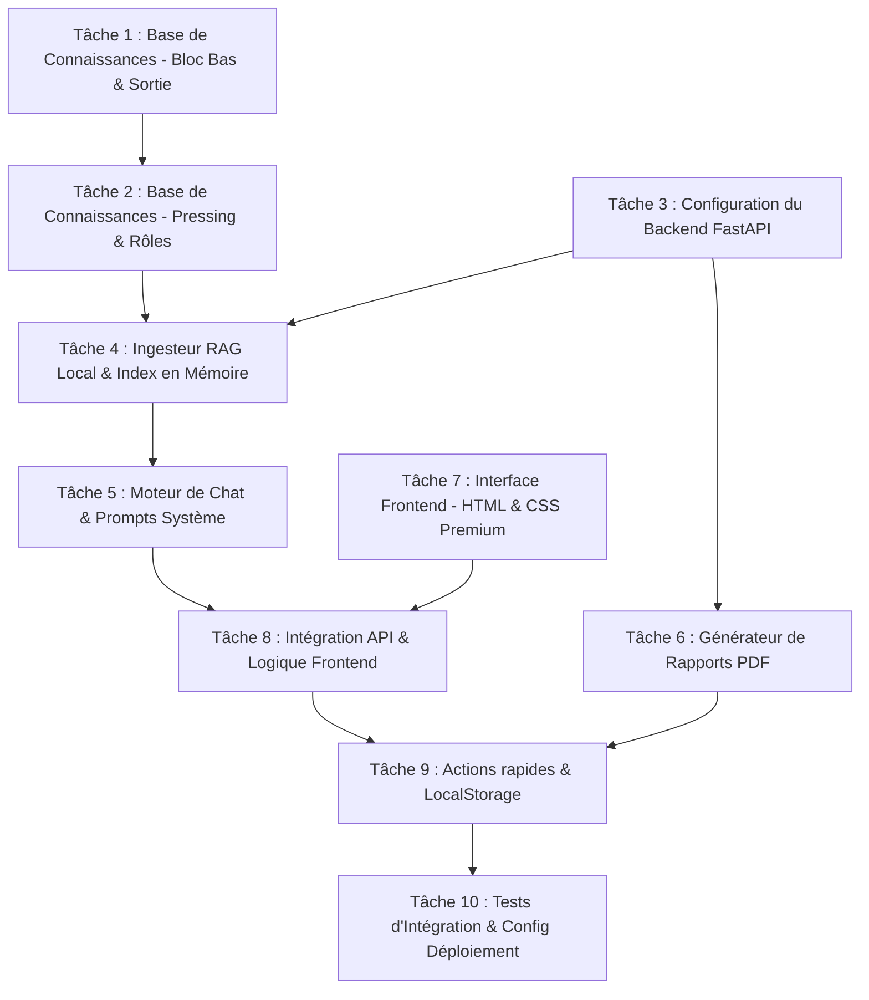

# 🏃‍♂️ Plan de Sprint 01 — Livraison du MVP Phase 1 (Football IQ Assistant)

Ce document décrit le plan d'action opérationnel pour le **Sprint 01**. L'objectif est de concevoir, développer et déployer la **Phase 1 (MVP)** de Football IQ Assistant dans un cadre de développement agile adapté à un développeur solo assisté par IA.

---

## 🏗️ 1. Analyse de l'Architecture Existante

### État Actuel du Projet
Le projet comporte actuellement deux grands blocs :
1. **Un prototype de Frontend (`Fonctionnement/architecture.html`) :** Un tableau de bord interactif modélisant la vision du produit, l'arborescence théorique du code et la roadmap CTO.
2. **Un pipeline RAG expérimental (`football-rag-system/`) :** 
   - Un script d'ingestion locale (`rag_preprocessing.py`) qui nettoie du texte brut (dans `data_football/`), effectue un découpage sémantique (chunking de taille 150, overlap 30) et génère un fichier plat `vectordb_ready_chunks.json`.
   - Une suite de tests unitaires (`tests/test_preprocessing.py`) validant le nettoyage de texte, l'extraction heuristique des métadonnées (catégories, années) et le découpage sémantique sans coupure de mots.

### Cibles Techniques pour la Phase 1 MVP
Pour transformer ce pipeline local en un produit utilisable sans friction par les coachs, nous devons poser les fondations suivantes :
- **Pas de base de données PostgreSQL/pgvector complexe (Choix CTO) :** Le RAG de la Phase 1 doit fonctionner avec un index de similarité en mémoire (en chargeant le fichier JSON pré-généré ou via un index léger comme `FAISS` / `Chroma` local) pour éliminer toute dépendance de base de données cloud ou locale.
- **Zéro authentification / Zéro inscription :** Toutes les sessions de chat et l'historique sont conservés côté client dans le `localStorage` du navigateur.
- **Backend FastAPI :** Il servira les requêtes du chat (Streaming LLM avec injection RAG) et gérera la génération de fichiers PDF.
- **Frontend SPA Premium :** Une interface en une seule page (Single Page Application) développée en HTML/JS moderne avec du CSS soigné (Dark mode, animations de transition, micro-interactions tactiques).

---

## 🧭 2. Séquence d'Exécution Optimale

Le travail est ordonné de manière à minimiser les risques techniques (les dépendances sont développées en premier) et à maximiser les boucles de validation (le contenu et l'API sont prêts avant d'assembler le frontend).

---

## 📝 3. Découpage Détaillé des Tâches (1 à 4 heures par tâche)

### 📂 BLOC A : CONNAISSANCE TACTIQUE (Jours 1 - 15)

#### 📌 Tâche 1 : Rédaction de la Base de Connaissances Tactiques - Partie A (Bloc Bas & Sortie de Balle)
* **Objectif :** Rédiger les premiers documents Markdown de référence tactique. L'IA s'appuiera sur ces textes pour générer ses conseils plutôt que sur des généralités du web. Les concepts doivent cibler : la gestion d'un bloc bas défensif, les principes de déséquilibrage (étirements, passes intérieures) et la relance basse (sorties à 3, troisième homme).
* **Fichiers concernés :**
  - `[NEW] football-rag-system/data_football/knowledge_base/bloc_bas.md`
  - `[NEW] football-rag-system/data_football/knowledge_base/sortie_balle.md`
* **Dépendances :** Aucune.
* **Temps estimé :** 3 heures.
* **Critère de validation :**
  - Au moins 5 pages de contenu Markdown structuré de haute qualité tactique.
  - Présence de concepts précis (ex: "supériorité numérique à la relance", "attirer le pressing pour jouer vertical").

#### 📌 Tâche 2 : Rédaction de la Base de Connaissances Tactiques - Partie B (Pressing, Contre-Pressing & Rôles)
* **Objectif :** Rédiger la deuxième partie des fiches tactiques en ciblant les phases de pressing (pressing haut, pressing orienté), le contre-pressing à la perte, et la définition moderne des rôles tactiques (Inverted Fullbacks, double pivot, faux 9, etc.).
* **Fichiers concernés :**
  - `[NEW] football-rag-system/data_football/knowledge_base/pressing_contre_pressing.md`
  - `[NEW] football-rag-system/data_football/knowledge_base/roles_modernes.md`
* **Dépendances :** Tâche 1.
* **Temps estimé :** 3 heures.
* **Critère de validation :**
  - Les fichiers Markdown sont créés et validés par une lecture humaine (ton d'entraîneur professionnel).

---

### 🖥️ BLOC B : INFRASTRUCTURE & BACKEND FASTAPI (Jours 16 - 25)

#### 📌 Tâche 3 : Setup de l'Environnement Backend & Architecture API
* **Objectif :** Initialiser le projet backend FastAPI. Configurer les variables d'environnement (`.env` pour les clés API OpenAI) et déclarer la structure des répertoires de l'API.
* **Fichiers concernés :**
  - `[NEW] backend/requirements.txt` (dépendances : fastapi, uvicorn, openai, python-dotenv, reportlab, pydantic)
  - `[NEW] backend/app/main.py`
  - `[NEW] backend/app/config.py`
* **Dépendances :** Aucune.
* **Temps estimé :** 2 heures.
* **Critère de validation :**
  - L'API démarre localement sans erreur via `uvicorn app.main:app --reload`.
  - La route `GET /api/health` renvoie `{"status": "healthy"}`.

#### 📌 Tâche 4 : Ingesteur RAG Local & Vectorisation en Mémoire
* **Objectif :** Adapter le pipeline existant pour parser automatiquement les fichiers Markdown de `data_football/knowledge_base/`. Utiliser l'API OpenAI (ou un modèle local léger) pour générer les embeddings et stocker le tout dans un fichier d'index en mémoire (`app/rag_index.json`) au lancement de l'application FastAPI, évitant ainsi le setup d'une base de données externe.
* **Fichiers concernés :**
  - `[NEW] backend/app/rag_engine.py`
  - `[MODIFY] football-rag-system/rag_preprocessing.py`
* **Dépendances :** Tâche 2, Tâche 3.
* **Temps estimé :** 4 heures.
* **Critère de validation :**
  - Une fonction `search_chunks(query, top_k=3)` retourne les fragments tactiques les plus pertinents et leurs sources en moins de 200ms.
  - Le fichier d'index en mémoire se charge correctement au démarrage de FastAPI.

#### 📌 Tâche 5 : Moteur de Chat & Prompts Système (Coach, Analyste, Fan)
* **Objectif :** Développer le service de génération de réponses LLM. Intégrer les trois prompts système (Coach, Analyste, Fan) et injecter le contexte issu du RAG local. Définir des modèles de sortie Pydantic stricts pour structurer les réponses selon les spécifications (ex: structure d'exercice pour le mode Coach, format thread/post réseaux pour le Fan).
* **Fichiers concernés :**
  - `[NEW] backend/app/prompts.py` (contenant les 3 prompts système complexes)
  - `[NEW] backend/app/chat_service.py`
  - `[MODIFY] backend/app/main.py` (ajout de la route `POST /api/chat`)
* **Dépendances :** Tâche 4.
* **Temps estimé :** 4 heures.
* **Critère de validation :**
  - L'endpoint `POST /api/chat` accepte une requête contenant la question et le mode sélectionné, et renvoie une réponse formatée et enrichie des sources citées.
  - Les réponses du mode Coach incluent systématiquement les sections : Résumé, Analyse, Conseils terrain, Exercice et Points d'attention.

#### 📌 Tâche 6 : Générateur de Rapports PDF Tactiques
* **Objectif :** Implémenter le service d'exportation PDF. Ce service doit prendre en entrée un plan d'entraînement structuré et le convertir en une fiche PDF de terrain élégante, prête à être imprimée, découpée en 4 blocs (Échauffement, Exercice 1, Exercice 2, Jeu final) avec le logo de l'assistant.
* **Fichiers concernés :**
  - `[NEW] backend/app/pdf_generator.py`
  - `[MODIFY] backend/app/main.py` (ajout de la route `POST /api/export-pdf`)
* **Dépendances :** Tâche 3.
* **Temps estimé :** 3 heures.
* **Critère de validation :**
  - L'endpoint `/api/export-pdf` génère et retourne un flux binaire PDF.
  - Le PDF généré s'ouvre correctement, respecte la structure à 4 blocs tactiques, et est optimisé pour l'impression A4.

---

### 🎨 BLOC C : FRONTEND CONVERSATIONNEL (Jours 26 - 32)

#### 📌 Tâche 7 : Interface Utilisateur CSS Premium & Layout HTML
* **Objectif :** Concevoir la structure visuelle de l'application (Single Page Application). Le design doit être extrêmement soigné (Dark mode complet, arrière-plan ardoise sombre, effets de verre dépoli (glassmorphism), barre de menu latérale, sélecteur de mode sous forme de gros boutons interactifs et typographie épurée).
* **Fichiers concernés :**
  - `[NEW] frontend/index.html`
  - `[NEW] frontend/styles.css`
* **Dépendances :** Aucune.
* **Temps estimé :** 4 heures.
* **Critère de validation :**
  - L'interface s'affiche de manière fluide sur navigateur de bureau et mobile (responsive complet).
  - Les boutons de sélection de mode (Coach, Analyste, Fan) changent d'état actif de façon dynamique et élégante.

#### 📌 Tâche 8 : Logique de Chat & Connexion à l'API Backend
* **Objectif :** Coder la logique JS pour gérer l'envoi de messages tactiques, l'appel asynchrone vers l'API FastAPI et le rendu dynamique des messages (avec prise en charge de base du format Markdown pour les listes et le gras) et des bulles de sources tactiques.
* **Fichiers concernés :**
  - `[NEW] frontend/app.js`
  - `[MODIFY] frontend/index.html`
* **Dépendances :** Tâche 5 (API Chat), Tâche 7 (Layout).
* **Temps estimé :** 4 heures.
* **Critère de validation :**
  - Poser une question tactique affiche un état de chargement élégant.
  - La réponse s'affiche avec le bon formatage Markdown et liste proprement les documents sources du RAG ayant servi à formuler la réponse.

#### 📌 Tâche 9 : Persistence Locale & Raccourcis d'Actions Rapides
* **Objectif :** Connecter les boutons d'actions rapides sous les réponses (Exporter PDF, Générer Post Réseaux, Simplifier, Approfondir). Implémenter le stockage de l'historique des conversations dans le `localStorage` du navigateur pour que l'utilisateur retrouve ses échanges sans création de compte.
* **Fichiers concernés :**
  - `[MODIFY] frontend/app.js`
  - `[MODIFY] frontend/index.html`
* **Dépendances :** Tâche 6 (API PDF), Tâche 8 (Logic base).
* **Temps estimé :** 3 heures.
* **Critère de validation :**
  - Cliquer sur "Exporter PDF" sous une réponse Coach télécharge le document d'entraînement immédiatement.
  - Cliquer sur "Générer Post" affiche un modal ou un bloc contenant le format court prêt à être copié pour Twitter/X.
  - Recharger l'application restaure la liste des discussions précédentes dans la barre latérale.

---

### 🚀 BLOC D : STABILISATION & DÉPLOIEMENT (Jours 33 - 35)

#### 📌 Tâche 10 : Tests d'Intégration & Configuration Déploiement Cloud
* **Objectif :** Écrire des tests d'intégration backend (avec `pytest` et `TestClient`) pour valider l'interaction Chat -> RAG -> LLM. Créer le fichier de configuration de production (ex: `render.yaml` ou `Procfile` / `Dockerfile`) pour packager FastAPI et le frontend statique ensemble afin de déployer l'application en un clic sur Render ou Railway.
* **Fichiers concernés :**
  - `[NEW] backend/tests/test_integration.py`
  - `[NEW] Dockerfile` (ou configuration Render/Railway)
  - `[NEW] .env.example`
* **Dépendances :** Toutes les tâches précédentes du sprint.
* **Temps estimé :** 3 heures.
* **Critère de validation :**
  - Les tests d'intégration se lancent et passent tous avec succès (`pytest backend/tests/`).
  - Le build local Docker ou le script d'amorçage de production démarre l'application sans erreur.
