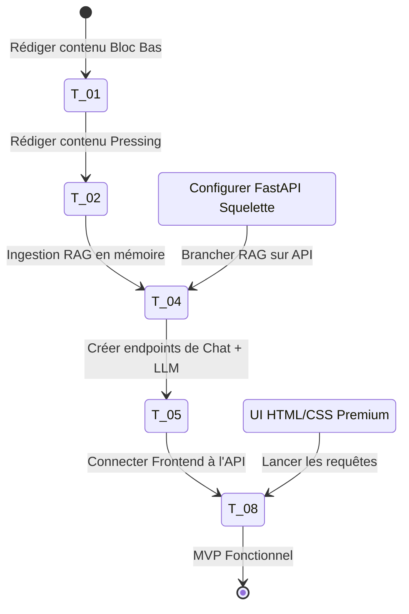

# 📊 Tableau de Bord de Suivi — Sprint 01 (Football IQ Assistant)

Ce document sert au pilotage quotidien de l'exécution du **Sprint 01**. Il permet de suivre l'avancement global, la vélocité et les blocages en temps réel.

---

## 📈 1. État d'Avancement Global

| Indicateur | Valeur | Commentaires |
| :--- | :--- | :--- |
| **Progression Globale** |  **30%** (3 / 10 tâches) | T-01, T-02 et T-03 complétés et validés. |
| **Temps Total Estimé** | **33 heures** | Estimation cumulée pour un développeur solo. |
| **Temps Réel Consommé** | **8 heures** | Fiches tactiques A et B, et initialisation de l'API FastAPI. |
| **Rendement (Réel/Est.)**| **100%** | Alignement parfait sur les estimations initiales. |
| **Prochaine Tâche** | **📌 Tâche 04 : Ingesteur RAG Local & Index en Mémoire** | Implémenter l'ingestion de la base de connaissances tactique. |

---

## 📦 2. Avancement par Bloc

### 📂 Bloc A : Connaissance Tactique (Jours 1 - 15)
- **Progression :** 100% (2 / 2 tâches terminées)
- **Temps :** 6h consommées / 6h estimées

### 🖥️ Bloc B : Infrastructure & Backend (Jours 16 - 25)
- **Progression :** 25% (1 / 4 tâches terminées)
- **Temps :** 2h consommées / 13h estimées

### 🎨 Bloc C : Frontend Conversationnel (Jours 26 - 32)
- **Progression :** 0% (0 / 3 tâches terminées)
- **Temps :** 0h consommées / 11h estimées

### 🚀 Bloc D : Stabilisation & Déploiement (Jours 33 - 35)
- **Progression :** 0% (0 / 1 tâche terminée)
- **Temps :** 0h consommées / 3h estimées

---

## 📋 3. Statut des Tâches du Sprint

| ID | Bloc | Tâche | Statut | Priorité | Est. | Réel | Dépendances | Risques / Blocages |
| :--- | :---: | :--- | :---: | :---: | :---: | :---: | :---: | :--- |
| **T-01** | A | Base de Connaissances - Bloc Bas & Sortie | `DONE` | Critique | 3h | 3h | Aucune | Aucune |
| **T-02** | A | Base de Connaissances - Pressing & Rôles | `DONE` | Critique | 3h | 3h | T-01 | Aucune |
| **T-03** | B | Setup de l'Environnement Backend & FastAPI | `DONE` | Critique | 2h | 2h | Aucune | Versioning de python-dotenv / Pydantic v2 |
| **T-04** | B | Ingesteur RAG Local & Index en Mémoire | `TODO` | Critique | 4h | - | T-02, T-03 | Limites de tokens ou de coûts d'API OpenAI |
| **T-05** | B | Moteur de Chat & Prompts Système | `TODO` | Critique | 4h | - | T-04 | Précision tactique de la réponse du modèle |
| **T-06** | B | Générateur de Rapports PDF Tactiques | `TODO` | Haute | 3h | - | T-03 | Mise en page ReportLab / débordement de page |
| **T-07** | C | Interface Frontend CSS Premium & Layout HTML | `TODO` | Haute | 4h | - | Aucune | Intégration Tailwind CDN vs CSS Custom |
| **T-08** | C | Logique de Chat & Connexion API | `TODO` | Critique | 4h | - | T-05, T-07 | Gestion du streaming de texte en vanilla JS |
| **T-09** | C | Persistence Locale & Actions Rapides | `TODO` | Haute | 3h | - | T-06, T-08 | Limites de taille de localStorage |
| **T-10** | D | Tests d'Intégration & Configuration Déploiement | `TODO` | Moyenne | 3h | - | Tous | Configuration CORS en production sur Render/Railway |

---

## 🛣️ 4. MVP Critical Path (Chemin Critique)

Le chemin critique représente l'ensemble des tâches indispensables pour obtenir un premier flux d'IA fonctionnel (RAG local + Chat en temps réel). Les tâches secondaires peuvent être livrées en fin de sprint si nécessaire.

---

## 🔍 5. Focus Tâche Recommandée

### [T-04] Ingesteur RAG Local & Index en Mémoire
- **Description :** Implémenter le chargeur de documents tactiques markdown de la base de connaissances. Créer l'indexation sémantique en mémoire (sans base de données vectorielle complexe pour le MVP) en utilisant les API d'embeddings d'OpenAI.
- **Fichiers concernés :**
  - `backend/app/services/rag_service.py` (Nouveau)
  - `backend/tests/test_rag.py` (Nouveau)
- **Critères de validation :**
  - Les fichiers MD de la base de connaissances sont parsés et découpés en chunks sémantiques.
  - La recherche sémantique renvoie les chunks les plus proches avec leur score de similarité cosinus.

---

## 🏁 6. Definition of Done (DoD) Globale

Pour qu'une tâche soit marquée comme **`DONE`**, elle doit valider les conditions suivantes :
1. **Qualité du code :** Aucun avertissement de type bloquant (type checking strict), conformité aux standards de clean code (Python PEP 8, Vanilla JS structuré).
2. **Tests :** 100% des tests unitaires et d'intégration liés à la tâche s'exécutent avec succès.
3. **Absence de régression :** Les fonctionnalités existantes (ex: pipeline d'ingestion existant) restent opérationnelles.
4. **Validation UX :** Le rendu visuel (mobile et desktop) respecte la charte graphique dark mode et ne présente aucun bug de débordement.
5. **Documentation :** La fiche technique correspondante est mise à jour et le changement est consigné dans le tableau de bord de suivi.

---

## ⚠️ 7. Journal des Risques et Blocages

*Aucun blocage ou risque actif à ce stade du projet.*
