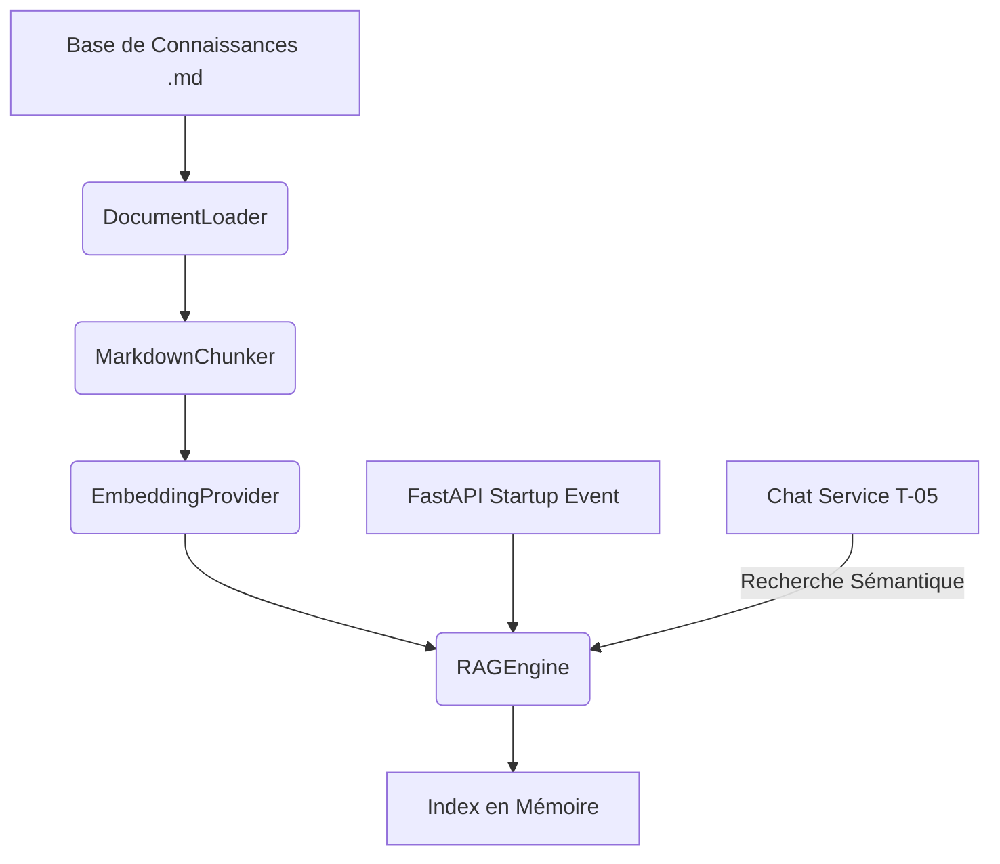

# 📋 Fiche Technique : Tâche T-04 — Ingesteur RAG Local & Index en Mémoire

Cette fiche définit les choix d'architecture, la stratégie technique, les risques et le plan d'implémentation pour le moteur de recherche sémantique (RAG) local en mémoire de Football IQ Assistant.

---

## 📐 1. Architecture Proposée

L'architecture du RAG se compose de 4 modules indépendants résidant dans le package `backend/app/services/` :

1. **`DocumentLoader`** : Scan le répertoire des fichiers de connaissances, lit les fichiers Markdown et extrait les métadonnées (titre principal, source, catégorie).
2. **`MarkdownChunker`** : Découpe le contenu brut en sections sémantiquement cohérentes (paragraphes sous les en-têtes `H2`/`H3`) pour éviter de fragmenter un concept tactique au milieu d'une phrase.
3. **`EmbeddingProvider`** : Calcule le vecteur numérique des textes.
   - En mode normal : Requête vers l'API OpenAI `text-embedding-3-small`.
   - En mode dégradé (fallback sans clé API valide) : Moteur TF-IDF léger écrit en Python natif pour assurer l'autonomie totale et locale des tests sans dépendance lourde.
4. **`RAGEngine`** : Orchestrateur central. Charge les documents au démarrage de FastAPI, génère l'index en mémoire (liste de dictionnaires contenant le texte, l'embedding et les métadonnées), et expose la méthode de recherche.

---

## ⚙️ 2. Choix Techniques & Alignement MVP

* **Pas de Base de Données Vectorielle (pgvector, ChromaDB, etc.) :** Pour la Phase 1, notre base de connaissances se limite à 4 documents tactiques (environ 30 à 40 chunks). Stocker l'index en mémoire dans une liste Python avec un calcul matriciel direct de similarité cosinus via la bibliothèque standard de Python ou `math` est ultra-rapide (< 1 ms par requête), éliminant toute complexité d'installation de base de données.
* **Format des Chunks :**
  - Taille cible : 150 à 300 mots pour une précision maximale lors de la génération.
  - Métadonnées injectées : Chaque chunk contiendra le titre du document parent et le nom de la section pour donner un contexte fort à l'embedding.
* **Algorithme de similarité :** Similarité Cosinus classique :
  $$\text{Similarité} = \frac{A \cdot B}{\|A\| \|B\|}$$

---

## ⚠️ 3. Risques et Mesures d'Atténuation

| Risque | Impact | Solution d'Atténuation |
| :--- | :--- | :--- |
| **Clé API OpenAI absente ou invalide** | Bloquant pour le RAG | Implémenter un **fallback local TF-IDF (vecteur creux)** en Python pur. Si la clé est manquante ou commence par `mock-`, le moteur RAG bascule automatiquement sur ce mode pour garantir que l'application démarre et que les tests passent en local. |
| **Consommation excessive de jetons (Tokens)** | Coûts d'API | Mise en cache optionnelle ou indexation uniquement lors du démarrage de l'application (pas à chaque requête utilisateur). |
| **Coupes de texte incohérentes** | Mauvais contexte LLM | Le découpeur découpera prioritairement sur les sauts de paragraphe `\n\n` et respectera les en-têtes Markdown. |

---

## 🚀 4. Plan d'Implémentation

### 📌 Étape T-04A : Lecteur de Documents et Découpeur (`document_loader.py`)
* Implémenter `DocumentLoader` pour charger récursivement les fichiers `.md` de `football-rag-system/data_football/knowledge_base/`.
* Implémenter le `MarkdownChunker` découpant par paragraphe tout en préservant le contexte du fichier source.

### 📌 Étape T-04B : Fournisseur d'Embeddings et Similarité (`embedding_provider.py`)
* Créer une interface unifiée pour le calcul d'embeddings.
* Implémenter la branche OpenAI et la branche locale native TF-IDF (extraction des tokens, calcul TF, calcul IDF, similarité cosinus).

### 📌 Étape T-04C : Moteur de Recherche Sémantique (`rag_engine.py`)
* Créer la classe `RAGEngine`.
* Charger et indexer les documents au démarrage.
* Implémenter `search(query, top_k=3)`.

### 📌 Étape T-04D : Tests Unitaires et d'Intégration (`tests/test_rag_engine.py`)
* Écrire des tests unitaires validant l'extraction des fichiers, le chunking, le calcul de similarité, et la recherche de requêtes réelles.

---

## 🧪 5. Critères de Validation

* [ ] La commande `pytest backend/tests/test_rag_engine.py` s'exécute avec succès.
* [ ] Une recherche sur `"sortie du pressing haut"` retourne en premier résultat un chunk issu de `sortie_balle.md` ou `pressing_contre_pressing.md`.
* [ ] Chaque résultat de recherche contient précisément les clés : `"text"`, `"source"`, `"score"` et `"metadata"`.
* [ ] Le moteur RAG s'initialise correctement et automatiquement sans planter si la clé API OpenAI est manquante ou factice (bascule sur TF-IDF).
* [ ] Le temps de réponse d'une recherche est inférieur à 100 ms.
