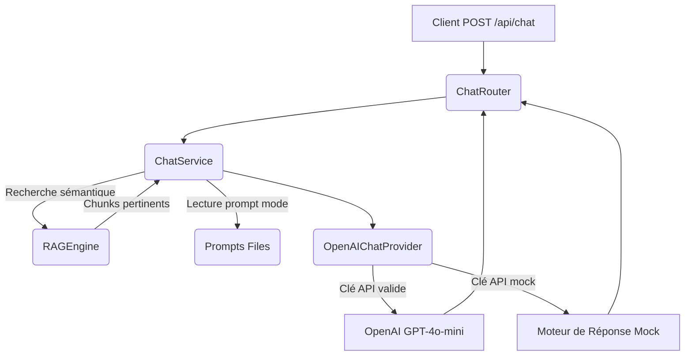

# 📋 Fiche Technique : Tâche T-05 — Moteur de Chat & Prompts Système

Cette fiche définit l'architecture logicielle, les choix techniques, les risques et le plan d'implémentation pour le service de chat de Football IQ Assistant, intégrant les modes Coach, Analyste et Fan ainsi que l'injection du contexte RAG.

---

## 📐 1. Architecture Proposée

Le service de chat interagit avec le moteur RAG existant et l'API OpenAI (ou un mock local) selon le flux suivant :

---

## ⚙️ 2. Choix Techniques

### A. Modèles Pydantic (`backend/app/schemas/chat.py`)
* **`ChatMode`** : Enum Python (`coach`, `analyst`, `fan`).
* **`ChatRequest`** : Contient le `message` de l'utilisateur, le `mode` choisi, et une liste optionnelle de `history` (structure conversationnelle transmise par le client : `[{"role": "user"|"assistant", "content": "..."}]`).
* **`SourceReference`** : Contient le `text` du chunk, sa `source` et son `score` de similarité.
* **`ChatResponse`** : Contient l'assistant `answer`, le `mode` utilisé, et la liste des `sources` référencées.

### B. Fichiers de Prompts Système (`backend/app/prompts/`)
Les prompts système sont stockés dans des fichiers `.txt` séparés pour faciliter leur modification future et leur maintenance :
1. **`coach_prompt.txt`** : Ton direct, axé sur la pédagogie terrain, les consignes d'entraînement concrètes et la terminologie de formateur (ex: "Chassez !", "Pied arrière !").
2. **`analyst_prompt.txt`** : Ton détaché, clinique, très tactique (demi-espaces, hauteur de bloc, structures 3-2-4-1, etc.) axé sur les rapports de performance.
3. **`fan_prompt.txt`** : Ton passionné, humoristique, émotionnel, de supporter (bande de vestiaire, références historiques).

### C. Moteur de Réponse Mock (Fallback Local)
Pour que le système puisse fonctionner hors-ligne (par exemple, pour les tests ou le développement sans connexion Internet), le service de chat générera des réponses enrichies dynamiquement en combinant :
- Le mode choisi.
- Les données brutes des chunks RAG trouvés.
- Une reformulation simple de la requête utilisateur.

---

## ⚠️ 3. Risques et Atténuations

| Risque | Impact | Solution d'Atténuation |
| :--- | :--- | :--- |
| **Clé API OpenAI invalide ou absente** | Erreur 500 sur le chat | Basculer automatiquement sur le générateur de réponses mock qui formule une réponse détaillée à partir des chunks RAG récupérés en local. |
| **Biais de contexte (hallucination)** | Réponses erronées | Le prompt système impose strictement de répondre "Je ne sais pas" si les données du RAG sont absentes ou insuffisantes pour répondre à une question tactique complexe. |
| **Accumulation de l'historique** | Dépassement de la fenêtre de contexte | Le client gère l'historique et nous le limitons côté serveur aux 5 derniers messages. |

---

## 🚀 4. Plan d'Implémentation

### 📌 Étape T-05A : Création des Fichiers de Prompts
* Créer les trois fichiers de prompt système dans `backend/app/prompts/` :
  - `coach_prompt.txt`
  - `analyst_prompt.txt`
  - `fan_prompt.txt`

### 📌 Étape T-05B : Schémas Pydantic (`schemas/chat.py`)
* Créer le fichier des schémas Pydantic déclarant l'Enum `ChatMode` et les objets de transfert de données `ChatRequest` et `ChatResponse`.

### 📌 Étape T-05C : Service de Chat (`services/chat_service.py`)
* Implémenter la classe `ChatService` :
  - Charger les prompts système depuis les fichiers texte.
  - Intégrer l'appel au RAGEngine.
  - Gérer l'appel à l'API OpenAI (via `client.chat.completions.create`) ou la bascule sur le mock local.

### 📌 Étape T-05D : Déclaration de la Route API (`api/chat.py`)
* Créer le routeur FastAPI exposant `POST /api/chat`.
* Inclure le routeur dans `backend/app/main.py`.

### 📌 Étape T-05E : Écriture des Tests Unitaires & d'Intégration
* Écrire `backend/tests/test_chat_service.py` pour valider le service (sélection des modes, injection du RAG, fallback mock).
* Écrire `backend/tests/test_chat_api.py` pour tester l'API REST FastAPI.

---

## 🧪 5. Critères de Validation

* [ ] Les fichiers de test s'exécutent et réussissent à 100% avec `pytest`.
* [ ] Une requête `POST /api/chat` en mode `coach` renvoie une structure JSON valide.
* [ ] La réponse contient la liste des sources RAG consultées (ex. `sortie_balle.md`).
* [ ] Le fallback fonctionne : si `OPENAI_API_KEY="mock-key"`, le système retourne une réponse mock formatée sans lever d'erreur.
* [ ] Les fichiers système de prompts sont stockés en dehors du code source, sous `backend/app/prompts/`.
