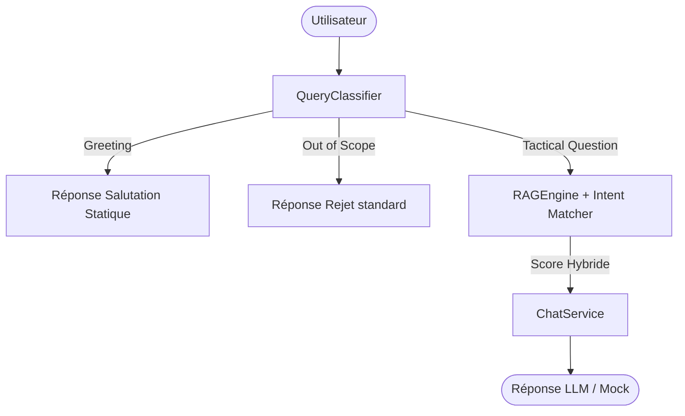

# 🛠️ Conception & Spécification du RAG Quality Fix (T-08.5)

Ce document décrit le diagnostic technique des faiblesses du RAG actuel, l'architecture du Query Classifier, la stratégie de scoring hybride avec pénalités de conflits d'intentions, et le cahier de tests de validation.

---

## 🔍 1. Diagnostic des Problèmes RAG Actuels

1. **Confusion Attaque vs Défense (Bloc Bas) :**
   - *Cause :* Le moteur RAG utilise uniquement la similarité cosinus TF-IDF (ou vectorielle brute). Les documents `bloc_bas.md` (défensif) et `principe_desequilibrer_bloc_bas.md` (offensif) partagent une forte densité lexicale commune (les termes "bloc bas", "surface", "lignes", "joueurs" sont répétés partout).
   - *Effet :* Une recherche purement vectorielle/lexicale brute mélange les deux aspects, renvoyant parfois des conseils d'attaque à une question de défense.

2. **Pollution par les Salutations ("salut") :**
   - *Cause :* Toute entrée utilisateur est envoyée directement au RAG. Pour "salut", le RAG cherche une similarité cosinus dans la base tactique. Ne trouvant rien de pertinent, il produit un score très faible qui ne correspond à aucun mot-clé des sources tactiques, déclenchant le message d'erreur : *"Je n’ai pas assez d’informations dans la base actuelle..."*.
   - *Effet :* Expérience utilisateur frustrante pour les interactions de bienvenue ou de politesse élémentaire.

---

## 📐 2. Architecture Proposée

---

## 📝 3. Règles de Classification (QueryClassifier)

Le `QueryClassifier` analysera le message utilisateur pour déterminer le type de requête et extraire les intentions tactiques.

### A. Types de Requêtes
- **`greeting`** : Détecté par regex insensibles à la casse (`\b(salut|bonjour|bonsoir|hello|hey|ça va|comment vas-tu)\b`).
- **`out_of_scope`** : Détecté par une liste de mots-clés interdits (ex: `pizza`, `météo`, `politique`, `cuisine`, `film`, `recette`).
- **`tactical_question`** : Requête par défaut liée au football.

### B. Intentions et Phases Tactiques
Si la requête est classée comme `tactical_question`, le classificateur extrait :
- **`intent`** :
  - `attack` : Déclenché par les mots-clés (`attaquer`, `déséquilibrer`, `percer`, `contourner`, `marquer`, `offensive`, `centrer`, `dédoubler`).
  - `defend` : Déclenché par les mots-clés (`défendre`, `coulisser`, `compacité`, `fermer l'axe`, `défensive`, `marquage`, `recul-frein`).
  - `roles` : Si mention de rôles spécifiques (`faux 9`, `pivot`, `double pivot`, `box-to-box`, `gardien-libéro`, `inverted fullback`).
  - `formations` : Si mention de systèmes de jeu (`4-3-3`, `3-5-2`, `4-4-2`, `3-4-3`).
- **`phase`** :
  - `offensive`
  - `defensive`
  - `transition`

---

## 📊 4. Stratégie de Scoring Hybride (RAGEngine)

Pour chaque chunk de document, nous calculons un score final ajusté $S_{final}$ :

$$S_{final} = S_{base} + \text{Bonus} - \text{Pénalité}$$

### A. Métadonnées des Chunks (DocumentLoader)
Chaque fichier de la base de connaissances se voit attribuer des métadonnées basées sur son nom de fichier :
- Fichiers `principe_desequilibrer_bloc_bas.md`, `phase_offensive_...` -> `intent: attack`, `phase: offensive`
- Fichiers `bloc_bas.md`, `transition_defensive_repli.md`, `analyse_video_cpa_defensifs.md` -> `intent: defend`, `phase: defensive`
- Fichiers `roles_...` -> `intent: roles`
- Fichiers `formation_...` -> `intent: formations`

### B. Ajustements de Score
- **Bonus d'Intention (+0.15)** : Appliqué si l'intention de la requête correspond exactement à l'intention du chunk.
- **Pénalité de Conflit d'Intention (-0.35)** : Appliquée si l'intention est opposée (ex: requête `defend` et chunk `attack`).
- **Bonus de Phase (+0.10)** : Appliqué si la phase de la requête correspond à la phase du chunk.
- **Pénalité de Phase (-0.20)** : Appliquée si la phase est opposée.
- Le score final est limité entre `0.0` et `1.0`.

---

## 🧪 5. Validation par les Tests Attendus

Les tests automatisés valideront les comportements suivants :
1. `salut` -> Réponse de bienvenue chaleureuse (pas d'appel RAG).
2. `comment défendre un bloc bas ?` -> Chunks de `bloc_bas.md` favorisés, aucun chunk de `principe_desequilibrer_bloc_bas.md` dans les premiers résultats.
3. `comment attaquer un bloc bas ?` -> Chunks de `principe_desequilibrer_bloc_bas.md` favorisés.
4. `recette de pizza` -> Rejet direct sans appel RAG.
